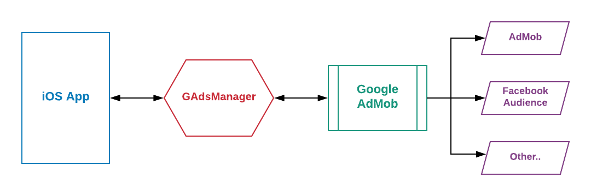
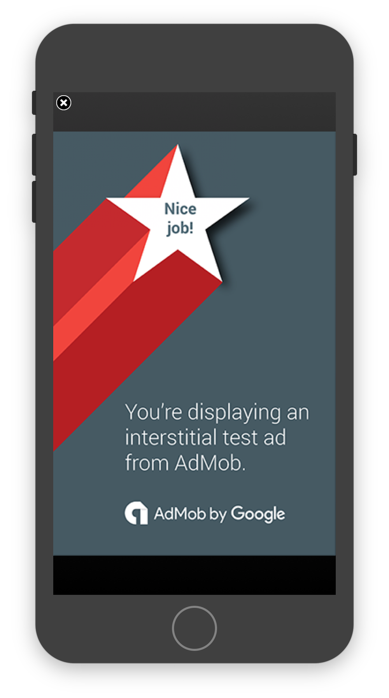

# GAdsManager
<p align="center">
    
    
    <a href="https://twitter.com/mahmudahsan">
        
    </a>
</p>

<p>
GAdsManager is a library which I created to use all my iOS apps to show ads. The library is developed based on Google Mobile Ads Sdk. Currently I am refactoring my old codebase and improving it to make a reusable library for all. In This library, I am combining all of the fetures over time including banner ads, interestial, reward video etc. so that one library can handle many different ads situation.  
</p>
<p>
This GAdsManager is a loosely coupled component. So its easy to use in any iOS project. And it is also possible to replace Google AdMob by other 3rd party ad network library. As it's a loosely coupled, it doesn't need to update the ads integration code in the app just need to update GAdsManager layer.
</p>

<p>
    
</p>

## Features

- [X] Loosely coupled component
- [X] Banner ads following Google AdMob Guideline
- [X] Banner ads with 5 pixel black border above 
- [X] Banner ads automatically adjust for portrait and landscape
- [X] Banner ads works on both iPhone and iPad
- [X] Interestial ads 

## Upcoming Features

- [ ] Reward Video Ads


<p align="center">
    
    
    
    
</p>	

## Examples Banner

Integrate bottom banner ads within a UIViewController via code:
```swift
import UIKit

enum AdIds : String {
    /** REPLACE THE VALUES BY YOUR APP AND AD IDS **/
    case appId  = "ca-app-pub-1873550908728968~3031818739" //app id
    case banner = "ca-app-pub-3940256099942544/2934735716" // test id
    case interestial = "ca-app-pub-3940256099942544/4411468910" // test id
}

let testDevices = [
    "XX",   //iPhone 5s
    "YY", // iPhone 6
]

//Call admanager with a delay so that safeAreaGuide value calculated correctly
DispatchQueue.main.asyncAfter(deadline: DispatchTime.now() + 2) {
    AdManager.shared.configureWithApp(AdIds.appId.rawValue)
    AdManager.shared.setTestDevics(testDevices: testDevices)
    AdManager.shared.bannerDelegate = self
    AdManager.shared.createBannerAdInContainerView(viewController: self, unitId: AdIds.banner.rawValue)
}

```
Get notification when banner ad received or failed by implementing the protocol and by setting the delegate:
```swift
public protocol AdManagerBannerDelegate{
    func adViewDidReceiveAd()
    func adViewDidFailToReceiveAd()
    func adViewWillPresentScreen()
    func adViewWillDismissScreen()
    func adViewDidDismissScreen()
}
```

## Examples Interestial
Request a new Interestial ad which will loaded in memory

```swift
AdManager.shared.createAndLoadInterstitial(AdIds.interestial.rawValue)
AdManager.shared.delegateInterestial = self
```
Show interestial ads
```swift
let isReady = AdManager.shared.showInterestial(self)
```

Get notification about interestial ads
```swift
public protocol AdManagerBannerDelegate{
    func adViewDidReceiveAd()
    func adViewDidFailToReceiveAd()
    func adViewWillPresentScreen()
    func adViewWillDismissScreen()
    func adViewDidDismissScreen()
}
```
<p>
        
</p>


## Dependency
- Add pod 'Google-Mobile-Ads-SDK' in your podfile and install Google-Mobile-Ads-Sdk Framework in your project via CocoaPods.

## Usage in an iOS application

Either

- Drag the folders GAdsManager/Source folder into your application's Xcode project. 

## Questions or feedback?

Feel free to [open an issue](https://github.com/mahmudahsan/AppsPortfolio/issues/new), or find me [@mahmudahsan on Twitter](https://twitter.com/mahmudahsan).
